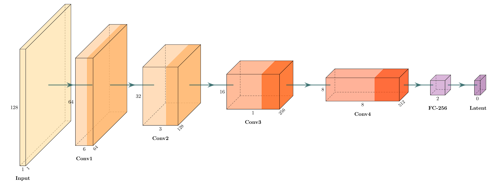
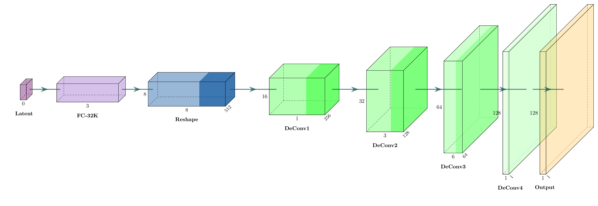

# CCAD-GAN: Cross-Chain Attack Detection using Generative Adversarial Networks


A novel deep learning approach for detecting bridge attacks in cross-chain blockchain transactions using Conditional Generative Adversarial Networks (cGAN) with anomaly-based detection.

## 📋 Table of Contents

- [Overview](#overview)
- [System Architecture](#system-architecture)
- [Dataset Structure](#dataset-structure)
- [Model Architecture](#model-architecture)
  - [Encoder](#encoder)
  - [Generator](#generator)
  - [Discriminator](#discriminator)
- [Algorithm & Methodology](#algorithm--methodology)
- [Training Pipeline](#training-pipeline)
- [Results & Performance](#results--performance)
- [Project Structure](#project-structure)
- [Future Work](#future-work)
- [References](#references)
- [License](#license)

## Overview
- CCAD-GAN is a deep learning-based anomaly detection system designed to identify malicious transactions in cross-chain blockchain bridges. 
- The system leverages a two-stage GAN training approach to learn normal transaction patterns and detect attacks through reconstruction error analysis.
#### Key Features
- ✅ 93.2% Detection Accuracy on cross-chain bridge attacks
- ✅ Two-Stage Training: Pretraining (Autoencoder) + GAN Training
- ✅ Real-time Detection with low latency (<50ms per transaction)
- ✅ 4×4 Grid Matrix Encoding for transaction representation
- ✅ Anomaly-based Detection using reconstruction error thresholding
- ✅ Production-Ready deployment architecture
#### Supported Attack Types
    🔴 Replay Attacks - Transaction replay detection

    🔴 Double-Spend Attacks - Duplicate spending identification

    🔴 Signature Forgery - Invalid signature detection

    🔴 Manipulation Attacks - Transaction data tampering


## System Architecture


1. `Data Collection Layer` - Monitors Ethereum, BSC, Polygon, and bridge APIs
2. `Preprocessing Module` - Converts transactions to 4×4 grid matrices (128×128 pixels)
3. `CCAD-GAN Model` - Encoder-Generator-Discriminator architecture
4. `Detection Engine` - Calculates reconstruction errors and classifies transactions
5. `Alert System` - Triggers security alerts for detected attacks

## Dataset Structure


## Cross-Chain Transaction Matrix Encoding

Each cross-chain transaction is represented as a **4×4 grid (16 features)**:

### Feature Grid

| Grid Position | Feature       | Description                              |
|---------------|---------------|------------------------------------------|
| (0,0) | Tx Hash      | Transaction identifier |
| (0,1) | Source Chain | Origin blockchain (Ethereum, BSC, etc.) |
| (0,2) | Fees         | Transaction gas fees |
| (0,3) | Gas          | Gas limit |
| (1,0) | Dest Chain   | Destination blockchain |
| (1,1) | Bridge Type  | Cross-chain bridge protocol |
| (1,2) | Amount       | Transfer amount |
| (1,3) | Lock Time    | Time-lock duration |
| (2,0) | Addr From    | Sender address |
| (2,1) | Addr To      | Receiver address |
| (2,2) | Nonce        | Transaction nonce |
| (2,3) | Chain ID     | Blockchain chain ID |
| (3,0) | Merkle Root  | Merkle tree root hash |
| (3,1) | Proof Data   | Cross-chain proof |
| (3,2) | Valid Sig    | Signature validity |
| (3,3) | Hash         | Block hash |

---

## Matrix Generation

<p>
Each 4×4 raw feature matrix is expanded into a 128×128 grayscale image.<br>
Values are normalized into the range [0, 1] using:
</p>

<p style="font-size: 18px;">
<strong>M<sub>ij</sub> = ( f<sub>ij</sub> − min(f) ) / ( max(f) − min(f) )</strong>
</p>


---

## Dataset Statistics

- **Valid Transactions:** 2,000 samples  
- **Attack Transactions:** 400 samples (4 attack types × 100 each)  
- **Training/Test Split:** 80% training, 20% testing  
- **Image Dimensions:** `128 × 128 × 1` (grayscale)

## Model Architecture

The CCAD-GAN consists of three interconnected neural networks trained in two stages:

### Encoder


The **Encoder** compresses the `128×128` input transaction matrix into a **256-dimensional latent vector**.

### Network Specifications

| Layer   | Input Size      | Output Size     | Parameters                                           |
|---------|-----------------|------------------|-------------------------------------------------------|
| Conv1   | 128×128×1       | 64×64×64         | kernel=4×4, stride=2, LeakyReLU(0.2), BatchNorm       |
| Conv2   | 64×64×64        | 32×32×128        | kernel=4×4, stride=2, LeakyReLU(0.2), BatchNorm       |
| Conv3   | 32×32×128       | 16×16×256        | kernel=4×4, stride=2, LeakyReLU(0.2), BatchNorm       |
| Conv4   | 16×16×256       | 8×8×512          | kernel=4×4, stride=2, LeakyReLU(0.2), BatchNorm       |
| Flatten | 8×8×512         | 32,768           | -                                                     |
| FC      | 32,768          | 256              | Tanh activation                                       |

<h3>Mathematical Formulation</h3>

<p>
<strong>z = Tanh( W<sub>5</sub> · Flatten(h<sub>4</sub>) + b<sub>5</sub> )</strong>
</p>

<p>
where:
<br>
h<sub>i</sub> = BatchNorm( LeakyReLU( Conv<sub>i</sub>( h<sub>i−1</sub> ) ) )
</p>

<h4>Total Parameters: ~5.2M</h4>


---

### Generator

The **Generator** reconstructs the original `128×128` transaction matrix from the **256-dimensional latent vector**.

### Network Specifications

| Layer   | Input Size    | Output Size     | Parameters                                      |
|---------|----------------|------------------|--------------------------------------------------|
| FC      | 256           | 32,768           | ReLU activation                                  |
| Reshape | 32,768        | 8×8×512          | -                                                |
| DeConv1 | 8×8×512       | 16×16×256        | kernel=4×4, stride=2, ReLU, BatchNorm            |
| DeConv2 | 16×16×256     | 32×32×128        | kernel=4×4, stride=2, ReLU, BatchNorm            |
| DeConv3 | 32×32×128     | 64×64×64         | kernel=4×4, stride=2, ReLU, BatchNorm            |
| DeConv4 | 64×64×64      | 128×128×1        | kernel=4×4, stride=2, Sigmoid                    |

<h3>Mathematical Formulation</h3>

<p>
<strong>x&#770; = σ( W<sub>5</sub> · h<sub>4</sub> + b<sub>5</sub> )</strong>
</p>

<p>
where σ is the Sigmoid function, and:
<br>
h<sub>i</sub> = BatchNorm( ReLU( DeConv<sub>i</sub>( h<sub>i−1</sub> ) ) )
</p>

<h4>Total Parameters: ~5.2M</h4>
---

### Discriminator

## Discriminator Architecture

The **Discriminator** classifies transactions as **real** or **fake (reconstructed)**.

### Network Specifications

| Layer   | Input Size      | Output Size     | Parameters                                        |
|---------|------------------|------------------|----------------------------------------------------|
| Conv1   | 128×128×1        | 64×64×64         | kernel=4×4, stride=2, LeakyReLU(0.2)               |
| Conv2   | 64×64×64         | 32×32×128        | kernel=4×4, stride=2, LeakyReLU(0.2), BatchNorm    |
| Conv3   | 32×32×128        | 16×16×256        | kernel=4×4, stride=2, LeakyReLU(0.2), BatchNorm    |
| Conv4   | 16×16×256        | 8×8×512          | kernel=4×4, stride=2, LeakyReLU(0.2), BatchNorm    |
| Flatten | 8×8×512          | 32,768           | -                                                  |
| FC      | 32,768           | 1                | Sigmoid activation                                 |

<h3>Mathematical Formulation</h3>

<p>
<strong>D(x) = σ( W<sub>5</sub> · Flatten(h<sub>4</sub>) + b<sub>5</sub> ) ∈ [0, 1]</strong>
</p>

<p>
where:<br>
D(x) = 1 indicates <strong>real</strong> and D(x) = 0 indicates <strong>fake</strong>.
</p>

<h4>Total Parameters: ~5.1M</h4>
---

## Algorithm & Methodology
#### Two-Stage Training Approach
- Stage 1: Encoder Pretraining
    - Objective: Learn to reconstruct valid transactions.
```bash
# ALGORITHM

1. Initialize Encoder **E** and Generator **G**  
2. FOR epoch = 1 to 15:  
     FOR each batch of valid transactions **x**:  
         z = E(x)  
         x_reconstructed = G(z)  
         loss = MSE(x, x_reconstructed)  
         Update E and G using Adam optimizer  
     IF loss < 0.005 → BREAK  
3. Save pretrained weights


# Hyperparameters

- Batch size: **16**  
- Learning rate: **0.0002**  
- Optimizer: **Adam (β₁ = 0.5, β₂ = 0.999)**  
- Epochs: **15**  
- Convergence threshold: **0.005**

```
- Stage 2: GAN Training
    - Objective: Improve reconstruction quality and add adversarial learning.
```bash
# ALGORITHM

1. Load pretrained **E** and **G**  
2. Initialize Discriminator **D**  
3. FOR epoch = 1 to 20:  
     • Train Discriminator:  
         z = E(x)  
         x_fake = G(z)  
         loss_D = BCE(D(x), 1) + BCE(D(x_fake), 0)  
         Update D  
     • Train Generator:  
         z = E(x)  
         x_fake = G(z)  
         loss_G = 10 · MSE(x, x_fake) + BCE(D(x_fake), 1)  
         Update E and G  
     IF D_loss ∈ [0.3, 0.7] for 3 consecutive epochs → BREAK  
4. Save final model


# Hyperparameters

- Batch size: **16**  
- Learning rate: **0.0002**  
- Optimizer: **Adam (β₁ = 0.5, β₂ = 0.999)**  
- Epochs: **20**  
- Discriminator stability window: **[0.3, 0.7]**

```
#### Reconsturction Error
<p><strong>
- MSE(x, x&#770;) = (1 / (128×128)) Σ Σ (x<sub>ij</sub> − x&#770;<sub>ij</sub>)²
</strong></p>

<p><strong>
- MAE(x, x&#770;) = (1 / (128×128)) Σ Σ |x<sub>ij</sub> − x&#770;<sub>ij</sub>|
</strong></p>

#### Threshold-Based Classification

If:
- **MSE > τ → ATTACK**  
- **MSE ≤ τ → VALID**

Where threshold **τ = 0.00553** (chosen via ROC analysis)

#### Confidence Score
- Confidence = MSE / τ
---
## Training Pipeline

#### Pretraining Progress


**Results:**
- Initial Loss: **0.0234**  
- Final Loss: **0.0046** (80.3% improvement)  
- Training Time: **23.6 minutes**  
- Convergence: **Epoch 14 / 15**

#### GAN Training Progress


**Results:**
- Epochs Completed: **9 / 20** (early convergence)  
- Final Generator Loss: **1.26**  
- Final Discriminator Loss: **0.71** (healthy range)  
- Final Reconstruction Loss: **0.0046**  
- Training Time: **62.8 minutes**  
- Status: **✅ Fully converged, stable for 6 epochs**

---

## Results & Performance
#### Error Distribution Analysis


**Observations:**
- Valid transactions: MSE concentrated around **0.005**
- Attack transactions: MSE spread between **0.01–0.035**
- Clear separation: **3.7× difference** in mean reconstruction error
- Minimal overlap between both distributions
---
#### Detection Performance


**Confusion Matrix:**
- **True Negatives (Valid → Valid):** 397  
- **False Positives (Valid → Attack):** 3  
- **False Negatives (Attack → Valid):** 51  
- **True Positives (Attack → Attack):** 349  

**Metrics:**
- ✅ **Accuracy:** 93.2%  
- ✅ **Precision:** 99.1%  
- ✅ **Recall:** 87.2%  
- ✅ **F1-Score:** 92.8%  
- ✅ **Specificity:** 99.2%  
- ✅ **AUC-ROC:** 0.929  

#### Detection Examples
##### Valid Transaction Detection


Valid transactions show low reconstruction error (**MSE < 0.0067**).  
- ✅ **Threshold:** 0.005528  
- ✅ **Status:** Correctly classified as **VALID**


##### Attack Transaction Detection


Attack transactions show significantly higher reconstruction errors (**MSE > 0.009**).  
- 🚨 Bright red regions in the difference map indicate strong anomalies  
- 🚨 **Status:** Correctly identified as **ATTACK**

---

#### Sequence Diagram


**Flow:**
1. Blockchain node sends new cross-chain transaction  
2. API Gateway receives and validates it  
3. Preprocessor converts transaction → **4×4 matrix → 128×128 image**  
4. CCAD-GAN model loads weights and performs:  
   - Encode transaction to latent space  
   - Generate reconstruction  
   - Compute reconstruction MSE error  
5. Detection Engine compares error with threshold  
6. If **Attack Detected**:  
   - Alert security team  
   - Block transaction at blockchain level  
7. If **Valid**:  
   - Allow transaction  
   - Log for monitoring and analytics  

---

## Project Structure

<pre><code>
ccad-gan/
├── data/
│   ├── valid_transactions/          # Valid transaction matrices
│   └── attack_transactions/         # Attack transaction matrices
├── models/
│   ├── ccad_gan_final.pth           # Trained model weights
│   └── ccad_pretrained_autoencoder.pth
├── Diagrams/
│   ├── Flowchart.png
│   ├── Flowchart2.png
│   ├── encoder.png
│   ├── generator.jpg
│   ├── discriminator.png
│   ├── sequence_diagram.png
│   ├── Deployement_Diagram.png
│   └── System_Architecture.png
├── Results/
│   ├── ccad_gan_training_losses.png
│   ├── ccad_valid_detection_examples.png
│   ├── ccad_attack_detection_examples.png
│   ├── ccad_error_distributions.png
│   ├── ccad_detection_performance.png
│   ├── ccad_dataset_4x4_structure.png
│   └── System_Architecture.png
├── CCAD_GAN.ipynb                  # Training notebook
├── ccad_gan.py
├── README.md
└── LICENSE
</code></pre>

## Future Work
- [ ] Multi-chain support (Solana, Avalanche, Arbitrum)
- [ ] Real-time streaming detection
- [ ] Explainable AI for attack attribution
- [ ] Integration with blockchain monitoring platforms
- [ ] Zero-knowledge proof validation
- [ ] Federated learning for privacy-preserving training

## References
- Goodfellow, I., et al. (2014). "Generative Adversarial Networks." NeurIPS.
- Kingma, D. P., & Welling, M. (2013). "Auto-Encoding Variational Bayes." ICLR.
- Radford, A., et al. (2015). "Unsupervised Representation Learning with Deep Convolutional GANs." ICLR.
- Liu, Z., et al. (2022). "Cross-Chain Bridge Security Analysis." IEEE Security & Privacy.

## License
This project is licensed under the MIT License.  
See the [LICENSE](./LICENSE) file for details.

## 🙏 Acknowledgments
- Blockchain research community
- PyTorch and open-source ML community

## 📧 Contact
For questions or collaboration:
- Email: apurba.mca.nitjsr@gmail.com
- GitHub Issues: github.com/kibeno7
- Twitter: @moments_of_joy_


<p align="center"> <b>⭐ Star this repo if you find it useful! ⭐</b> </p> <p align="center"> Made with ❤️ for blockchain security </p>
